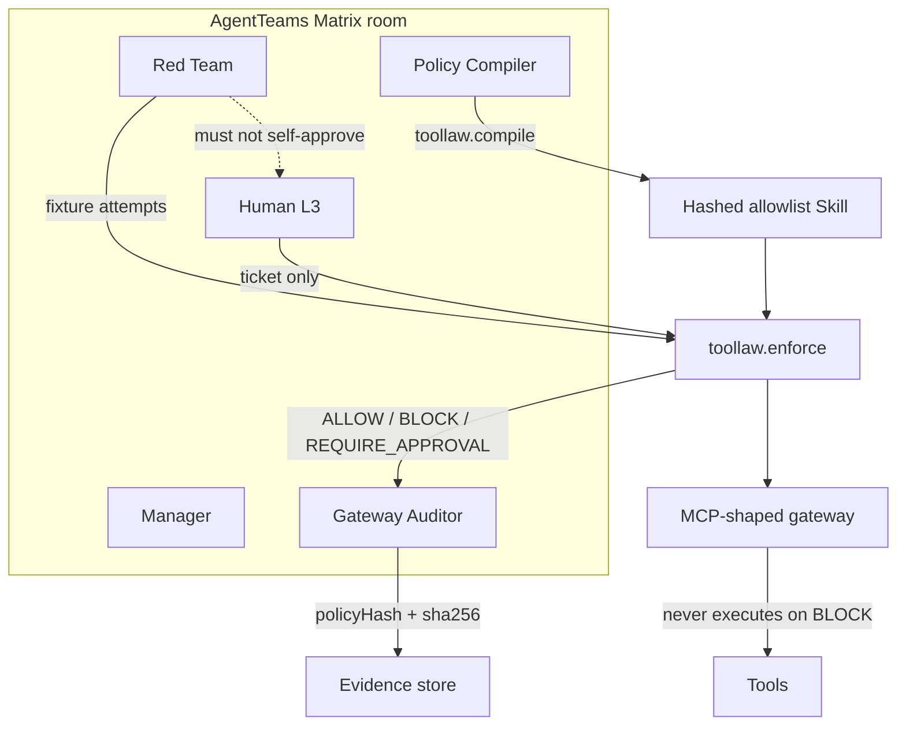
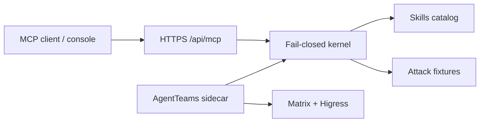

# TOOLLAW

**GOAI 2026 · Track 1 Agent Infra** · Accra Technical University · Apache-2.0

TOOLLAW compiles **who may call which Skill or MCP tool, with which arguments,** into a fail-closed allowlist. Policy Compiler writes a hashed artifact. Red Team must lose in the Matrix room. Gateway Auditor proves forbidden calls did not execute and emits receipts. Human ALLOW is L3-only.

Traces show what happened. TOOLLAW decides what is allowed.

**Live:** [https://toollaww.vercel.app](https://toollaww.vercel.app) · **MCP:** [https://toollaww.vercel.app/api/mcp](https://toollaww.vercel.app/api/mcp)

## Architecture





Default is **BLOCK**. Unknown tools, peer-env paths, unsettled redeem, and Red Team calling approve never execute.

## Crew

| ID | Role | May | Must not |
|---|---|---|---|
| mgr | Manager | Create Team, track state | Fire tools |
| pol | Policy Compiler | Compile YAML → allowlist | Execute risky tools |
| red | Red Team | Attack with forbidden Skills | Self-approve |
| aud | Gateway Auditor | Match traces, emit evidence | Weaken allowlist |
| hum | Human L3 | ALLOW / DENY | Be optional on high-risk |

State: `OPEN → COMPILING → ATTACKING → BLOCKED | AWAITING_APPROVAL → VERIFYING → CLOSED`

## Skills

`toollaw.compile` · `toollaw.enforce` · `toollaw.redteam` · `toollaw.evidence` · `toollaw.approve` · `toollaw.health` · `toollaw.deny-unhalt`

Specs in [`skills/`](skills/). Contracts in [`contracts/`](contracts/). Fixtures in [`fixtures/`](fixtures/). Handbook: [`docs/PRELIM_HANDBOOK.md`](docs/PRELIM_HANDBOOK.md).

## Run

```sh
npm i
npm test
npm run e2e
npm run sidecar
```

List MCP tools:

```sh
curl -s -H "content-type: application/json" \
  -d "{\"jsonrpc\":\"2.0\",\"id\":1,\"method\":\"tools/list\"}" \
  https://toollaww.vercel.app/api/mcp
```

Sidecar home is `/var/lib/toollaw`. Do not put API keys, tokens, or private keys in git. Gateway holds credentials; Workers receive ALLOW/BLOCK JSON only.
