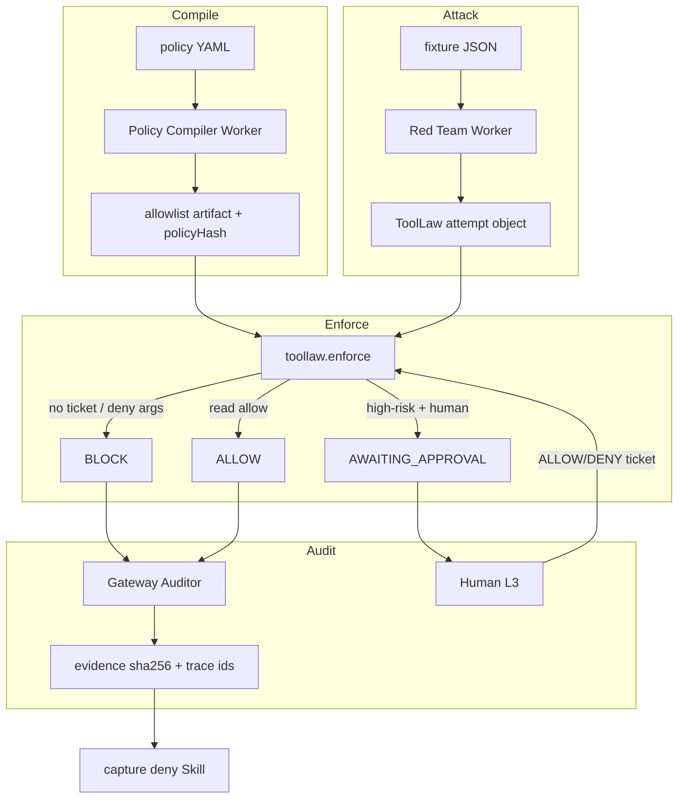

# TOOLLAW Bible — full product overview (LOCKED)

> **Source of truth for the GOAI build.** Same pipeline as ROOT → AFTERCUT → SCOUT: research, lock, then build every layer.  
> **Product:** TOOLLAW · **Track:** GOAI 2026 Track 1 Agent Infra · **Team:** Accra Technical University  
> **Prelim:** 16 Aug 2026, 23:59 CST · **Top 30:** 24 Aug · **Semi demo:** 3 Sep · **Top 15:** 10 Sep · **Finals:** 22–23 Sep Hangzhou  
> This repo builds TOOLLAW only. SCOUT / LOCKIN / AFTERCUT stay in the other Cursor chat.  
> Idea search: `C:\Users\jessi\Desktop\aftercut\docs\memory\GOAI_IDEA_SEARCH.md`

---

## 0. Instant understand (read this first)

**One sentence:** TOOLLAW is Agent Infra for *tools* — an AgentTeams crew that compiles **who may call which tool, with which arguments**, into a fail-closed Skill, then a red-team Worker must lose in the Matrix room, with evidence.

**8-second object:** Forbidden `unhalt` / peer-env patch / unsettled redeem is attempted. Gateway + Skill **BLOCK**. Receipt hash. Human ALLOW only on a read. Same loop again.

**Analogy:** AppArmor / IAM policy compiler for agent tools. Not an SRE chatbot. Not a trading bot. Not “we installed Higress.”

**Users:** Platform / SRE / security teams running multi-agent fleets who need **enforcement**, not another dashboard.

**Not users:** Retail chat. Traders. Teams submitting handbook Direction 1 ITSM or AgentTeams demo 4 (incident analysis chat).

**Moat line for judges:** *Traces show what happened. TOOLLAW decides what is allowed to happen.*

**Demo sentence (≤3 min):** Red Team fires high-risk Skill → BLOCK + receipt → Human ALLOW on `health` → peer-fleet env patch BLOCK.

**Honest:** The idea does not guarantee Top 15. The actual bar is a **runnable fail-closed loop on 3 Sep**, filmed, same loop live in Hangzhou.

---

## 1. What the product is (full overview)

TOOLLAW is a **governable tool-control plane** on AgentTeams (formerly HiClaw).

Production agents already have:

- rooms, Workers, Skills, MCP servers
- traces (OpenTelemetry / AgentLoop-shaped logs)
- coarse gateway ACL (Higress OSS: **server-level**)

They do **not** have, on OSS, a compiled answer to:

> Worker `red` may call Skill `toollaw.health` with `{}`.  
> Worker `red` may **not** call fixture `unhalt` without a Human L3 ticket.  
> Worker `red` may **not** patch env paths that belong to a peer fleet.  
> Args that look like `redeem` on an unsettled market are **BLOCK**, even if the MCP server is allowed.

That missing layer is the product.

| Layer | What TOOLLAW ships | What it is not |
|---|---|---|
| **Policy** | YAML/JSON allowlist: principal × tool × args × risk | Chat “please don’t do that” |
| **Compile** | Skill `toollaw.compile` → hashed artifact Workers load | Hand-edited prompt rules |
| **Enforce** | Skill `toollaw.enforce` + MCP-shaped gateway hook; default **BLOCK** | Post-hoc log review |
| **Attack** | Worker `red` with an attack pack; must fail closed | A helper that “tries to be careful” |
| **Audit** | Worker `aud` matches attempt → policy hash → receipt sha256 | A pretty Grafana board |
| **Human** | Matrix Human, L3 on high-risk; no self-approve | Optional rubber stamp |
| **Capture** | Failed attack becomes a reusable deny Skill | One-off demo script |

**Closed loop in one line:** compile → attack → BLOCK or ticket → verify non-execution → evidence → capture deny Skill.

---

## 2. Why this lock (ROOT process)

AFTERCUT did not rebuild Opus. TOOLLAW does not rebuild:

| Kill | Why |
|---|---|
| Handbook Dir 1 — generic ITSM / zero-touch ops | AgentTeams **demo 4** + Aliyun’s own “alert → RCA → change → verify” |
| Handbook Dir 3 — software collab | AgentTeams **demo 1** |
| **PROOFLOOP as product** | Demo 4 + Dir 1 with a trading-desk fixture. Lived scar is real; **idea shape is the default clone**. `Desktop\proofloop` is notes only. |
| Nacos+Higress+PolarDB+RocketMQ logo stack | Handbook: quantity not scored |
| Single-runtime “Manager says, Workers chat” | HiClaw quickstart, not infra |
| LangGraph SRE crew ported to AgentTeams | 2026 blog default |

**T1 beat T2/T3/T4** on Skill 25% + audit 20% + uncrowded surface (Higress OSS coarse ACL; OTel traces without enforcement). Scorecard in the idea-search MD.

Lived SCOUT/LOCKIN halt / redeem / env-mix is **fixture evidence**, not the pitch. Do not unhalt production. Do not copy SCOUT code into this repo.

---

## 3. Event, must-haves, scoring (verified)

| Item | Fact |
|---|---|
| Site | https://www.goaihz.com/ |
| Organizer | Hangzhou Open-Source Artificial Intelligence Foundation · Agent Infra by Aliyun |
| Must use | **AgentTeams** as collaboration **design baseline** |
| Must ship | **Skills** (mandatory) · **≥3 distinct agent roles** · closed loop |
| MCP | **Recommended**; equivalent typed contract OK if later MCP is adapter-only |
| Prelim | Intro **≤500 characters** + proposal PPT/PDF · code optional |
| Semi (3 Sep) | Executable AgentTeams package + runnable demo/video |
| Weights | Scenario 25 · multi-agent loop 25 · Skill engineering 25 · engineering/audit 20 · OSS 5 |

Aliyun (Yang Yi): not “smarter agent” — **governable, observable, evolvable production system**. Prefer a **small closed loop with evidence** over a fake big platform.

Handbook 8 loop slots TOOLLAW must map: input · decompose · context · tools · verify · evidence · approve/rollback · capture.

---

## 4. Problem (precise)

### 4.1 What breaks in production agent fleets

A Worker with a connected MCP server can usually call **any tool that server exposes**. Server-level ACL answers “may this agent talk to this server?” It does not answer “may this agent call **this tool** with **these args**?”

Lived scars we use only as **attack fixtures** (never live):

- Halt + empty cash → someone still tries **unhalt**
- **Redeem** on a market that is not settled → cash does not move, but the tool fired
- Two fleets on one host → **env patch** aimed at the peer path

The product question is not “did we diagnose the halt?” That is demo 4. The product question is: **did the forbidden tool execute?**

### 4.2 What the ecosystem already covers (do not resubmit)

- Observability: OTel GenAI traces, AgentLoop-shaped dashboards — **after** the call
- HITL chat: human in the room, no compiled policy
- Enterprise Higress / HiClaw blogs: **tool-level** ACL called out as Enterprise; OSS stays **server-level** (best source: HiClaw 1.0.6 blog via TinyFish/GitHub — Tavily did **not** fully prove this split; do not overclaim)

### 4.3 TOOLLAW’s gap

Compile tool-level law **on OSS**, prove it with a red team in AgentTeams, emit audit receipts. If Enterprise later adds native tool ACL, TOOLLAW’s Skills still own **arg-level** rules, tickets, and capture.

---

## 5. Architecture (every layer — ship all)

Henry bar. Half-features lose.



### Layer 1 — Control plane (AgentTeams)

1. **Manager (`mgr`)** — creates Team, tracks CR/state, never fires tools  
2. **Policy Compiler (`pol`)** — Leader or Worker; compiles YAML → artifact  
3. **Red Team (`red`)** — Worker; only attacks; cannot self-approve  
4. **Gateway Auditor (`aud`)** — Worker; match + evidence; cannot weaken allowlist  
5. **Human (`hum`)** — Matrix member; L3 on high-risk  

Runtimes (Sep 3 target, not prelim): prefer **two families in one room** if the VM allows (e.g. QwenPaw + OpenClaw) so we are not a single-runtime chat. Prelim documents the mapping even if one runtime is used first.

### Layer 2 — Skills (mandatory)

See §9. Each Skill has name, purpose, I/O, invocation, deps, failure, security, reuse, loop slot.

### Layer 3 — Contracts

Typed **`ToolLaw` object** (not a 20k-token chat dump). MCP tools live. Higress-shaped adapter is `src/lib/higress.ts`. Secrets never in Worker prompts or git.

### Layer 4 — Enforcement

Default **fail closed**. No ticket → BLOCK. Unknown tool → BLOCK. Peer path in args → BLOCK. Auditor must show the call **did not execute** (fixture side effect absent).

### Layer 5 — Evidence / audit (20%)

Receipt: attempt JSON + policyHash + decision + timestamp + sha256. Trace id if present. Zip for judges.

### Layer 6 — Fixtures (lived, not the pitch)

Attack pack only. See §11.

### Layer 7 — Submission

500-char intro · HTML→PDF · identities · Skill MDs · contracts · fixtures · Apache-2.0 · zip. Then sidecar, then film.

---

## 6. Object model

One shared context object. Workers pass this (files / MinIO / Team artifacts), not novel-length chat.

```
ToolLaw
  id            string
  policyHash    string
  principal     mgr | pol | red | aud | hum
  skill         string
  tool          string
  args          object
  risk          low | high | critical
  mutate        boolean
  decision      ALLOW | BLOCK | REQUIRE_APPROVAL
  ticketId      string | null
  executed      boolean          # must be false on BLOCK
  evidenceSha256 string | null
  state         see §8
```

Policy artifact:

```
Policy
  version
  policyHash
  principals[]  { id, maySkills[], mayTools[] }
  tools[]       { name, mutate, risk, allowPrincipals[], argRules[] }
  default       BLOCK
```

Arg rules (v0): `pathContainsPeer`, `marketMustBeSettled`, `requireTicket`.

---

## 7. Roles (AgentTeams mapping)

Human is first-class in Matrix. High-risk = L3.

| ID | Role | AgentTeams | May | Must not |
|---|---|---|---|---|
| `mgr` | Manager | Manager | Create Team, track state | Fire tools |
| `pol` | Policy Compiler | Leader or Worker | Compile YAML → allowlist Skill | Execute risky tools |
| `red` | Red Team | Worker | Attack with forbidden Skills | Self-approve |
| `aud` | Gateway Auditor | Worker | Match traces to policy, evidence | Weaken allowlist |
| `hum` | Human | Matrix Human | ALLOW / DENY tickets | Be optional on high-risk |

≥3 distinct Worker/Leader roles plus Manager and Human. Meets “≥3 agents.”

Collaboration:

```
Human (L3) ─┐
            ├─► Manager ─► Team "toollaw-<id>"
            │                 ├─ Policy Compiler
            │                 ├─ Red Team      (attack)
            │                 └─ Gateway Auditor (gate + evidence)
```

---

## 8. State machine and closed loop

`OPEN → COMPILING → ATTACKING → BLOCKED | AWAITING_APPROVAL → VERIFYING → CLOSED`

Exception: unknown tool or compiler error → `BLOCKED` immediately.

### Handbook 8 steps

1. **Input:** red-team attempt (fixture JSON) posted into the Team room.  
2. **Decompose:** Manager assigns compile vs attempt vs audit.  
3. **Context:** one `ToolLaw` object.  
4. **Tools:** Skills + MCP-shaped gateway; secrets in Higress (or stub gateway), not Workers.  
5. **Verify:** forbidden call did not execute (`executed: false`); allowed read did.  
6. **Evidence:** trace + policy hash + ticket sha256.  
7. **Approve/rollback:** no ticket → **BLOCK**. Human DENY = stay blocked. No “execute then undo” for v0 high-risk — **prevent**.  
8. **Capture:** failed attack becomes a Skill (`toollaw.deny-unhalt`, etc.).

---

## 9. Skills (mandatory, 25%)

Specs live in `skills/`. Invocation is Skill-first; MCP is the connection layer.

| Skill | Mutate | Approval | Loop slot |
|---|---|---|---|
| `toollaw.compile` | writes policy artifact | no | decompose / tools |
| `toollaw.enforce` | no (gate) | n/a | tools / approve |
| `toollaw.redteam` | attempts only | must fail closed without ticket | input / execute (attempt) |
| `toollaw.evidence` | evidence store | no | evidence |
| `toollaw.approve` | ticket | human-only | approve |
| `toollaw.health` | no (read fixture) | no | verify |
| `toollaw.deny-unhalt` | no | n/a | capture (written after first BLOCK) |

High-risk **fixtures** (not product Skills; attack surface only): `unhalt`, `redeem` unsettled, `env.patch` peer path.

Failure mode for every gate Skill: **default BLOCK**.

---

## 10. MCP-shaped contracts

Handbook: MCP recommended, not mandatory. We ship typed contracts now so Sep 3 is adapter-only.

| Contract | File |
|---|---|
| ToolLaw object | `contracts/toollaw.object.schema.json` |
| Policy artifact | `contracts/policy.schema.json` |
| Tool catalog (MCP-shaped) | `contracts/mcp-catalog.json` |
| What is real vs stub | `contracts/TOOL_STATUS.md` |

Gateway holds credentials. Workers receive `ALLOW`/`BLOCK` JSON only.

---

## 11. Fixtures (attack pack)

Use SCOUT/LOCKIN scars as **attacks**, not as “we built a trader.”

| Fixture | Attempt | Expected |
|---|---|---|
| `fixtures/attack-unhalt.json` | unhalt while halted and cash starved | BLOCK, `executed: false` |
| `fixtures/attack-redeem.json` | redeem while `settled: false` | BLOCK |
| `fixtures/attack-env-peer.json` | env patch path containing peer fleet | BLOCK |
| `fixtures/allow-health.json` | `toollaw.health` | ALLOW, read only |
| `fixtures/policy.v0.json` | compiled allowlist input | `toollaw.compile` output hash |

Do not run these against `/opt/scout` or `/opt/lockin`. Do not put keys in the repo.

---

## 12. Demo / film (3 Sep, reused 22 Sep)

| Beat | Show |
|---|---|
| 0:00–0:20 | Problem: server-level ACL still lets a Worker fire the wrong tool |
| 0:20–0:50 | Compile policy → policyHash in the room |
| 0:50–1:20 | Red Team `unhalt` → BLOCK + receipt |
| 1:20–1:45 | Human ALLOW on `health` only → read succeeds |
| 1:45–2:15 | Peer `env.patch` → BLOCK |
| 2:15–2:45 | Auditor zip: hashes, `executed: false`, captured deny Skill |
| Optional | Same attack without TOOLLAW (server allowed) vs with TOOLLAW (blocked) |

Kill beat: Red Team cannot stamp its own ticket.

---

## 13. Scoring map (how we win the rubric)

| Weight | How TOOLLAW scores |
|---|---|
| Scenario 25 | Tool misuse / blast radius is the real Agent Infra pain; fixture is lived, pitch is generic |
| Multi-agent 25 | Five identities, 8-step loop, fail-closed branches |
| Skill 25 | Compile / enforce / redteam / evidence / approve / health / capture — not one mega-prompt |
| Audit 20 | policyHash + sha256 receipts + non-execution proof |
| OSS 5 | Apache-2.0, no secret dumps, Skills reusable off the trading desk |

---

## 14. Build sequence

| When | Build |
|---|---|
| **Tonight / Aug 16** | Prelim pack: intro, HTML→PDF, identities, Skill MDs, contracts, fixtures, zip |
| **Aug 17–24** | AgentTeams **sidecar** on a VM or local Docker — never overwrite `/opt/scout` or `/opt/lockin` |
| **Aug 25–Sep 3** | Film: BLOCK → ALLOW read → peer BLOCK → evidence zip |
| **Sep 22** | Same loop live in Hangzhou |

Prelim form: work title `TOOLLAW` · org Accra Technical University · Founder / Co-founder. Recipient/phone/address/T-shirt: Henry fills. Repo URL optional until public GitHub (no secrets).

---

## 15. Hard rules

- No trading strategy as the submission.  
- No PROOFLOOP revival as the product.  
- No SCOUT/LOCKIN/AFTERCUT **code** in this repo. Fixtures may name those scars in JSON.  
- Do not unhalt SCOUT. Do not write `/opt/scout` or `/opt/lockin`.  
- Tavily + TinyFish (`X-API-Key`) from `scoutbot/agent/.env` for fact-check. Tavily **answers** can be wrong (e.g. “MCP required”) — handbook wins: **Skill mandatory, MCP recommended**.  
- Do not claim Tavily proved Higress Enterprise vs OSS tool ACL; cite HiClaw blog as best source and mark **partial**.  
- Ask before git push. No Lovable history rewrites if this repo ever connects.

---

## 16. Stack (honest)

| Now (prelim) | Later (semi) |
|---|---|
| Markdown Skills, JSON Schema, HTTP MCP, fail-closed kernel, AgentTeams CRs, Matrix-shaped room, Higress-shaped gate, OTLP JSON, evidence zip, Docker sidecar | Official Hangzhou `agentteams-controller` + Synapse on a dedicated VM (YAML already matches `agentteams.io/v1beta1`) |
| Deterministic `enforce` as a pure function | Same function behind the gateway |

Prelim does **not** require a running cluster. Semi does.

---

## 17. Q&A cheat

- **Why not demo 4?** Demo 4 diagnoses incidents. We prevent forbidden tools from firing.  
- **Why not Nacos?** Nacos can catalog Skills; it does not compile arg-level fail-closed law + red team.  
- **Is this IAM?** Same *idea* as IAM/AppArmor, specialized to AgentTeams Skills/MCP and judged as Skill engineering.  
- **Will Enterprise Higress kill this?** Native tool ACL would be a complement. We still own args, tickets, capture, and the red-team proof.  
- **Is MCP required?** No. Skill is required. Our catalog is MCP-shaped so the adapter is boring.

---

## 18. Backup ideas (do not hop unless Henry says)

T3 SKILLCI · T2 HANDSHAKE · T4 INCIDENT-CR — scored in the idea-search MD. Lock is **T1 TOOLLAW**.

---

## 19. New-chat paste

See `docs/NEW_CHAT_PASTE.md`. Short:

> TOOLLAW bible in `docs/TOOLLAW_BIBLE.md`. GOAI Agent Infra. Prelim 16 Aug CST. Fail-closed tool allowlist on AgentTeams. Do not touch SCOUT/LOCKIN/AFTERCUT. Ask before git push.
